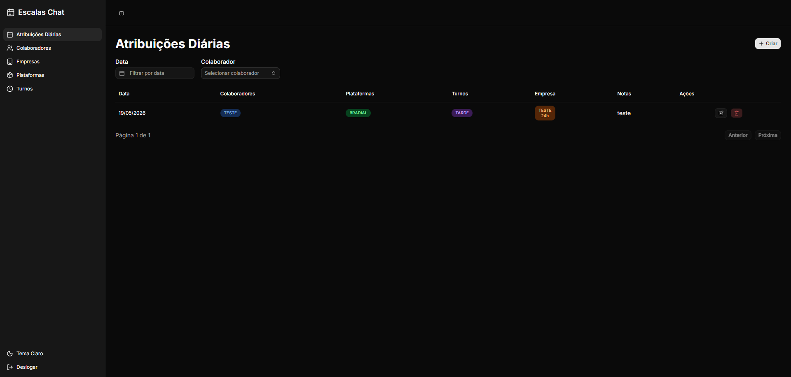
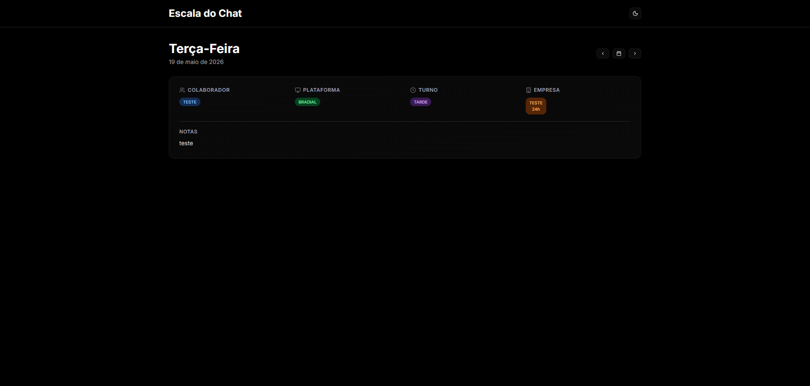

# Escala Chat

Um aplicativo moderno para gerenciamento de escalas de atendentes de chat, construído com **Next.js**, **PocketBase** e containerizado com **Docker**.

## 🎯 Sobre o Projeto

Escala Chat é uma solução para facilitar o gerenciamento de horários e escalas de atendentes de chat. O aplicativo oferece uma interface intuitiva para:
- Visualizar e gerenciar escalas de atendimento
- Sincronizar dados em tempo real
- Acompanhar disponibilidade dos atendentes

## 📸 Capturas de Tela

### Dashboard


### Tempo Real


## 🛠️ Tecnologias

- **Frontend**: [Next.js 16](https://nextjs.org/) + [React 19](https://react.dev/)
- **Backend**: [PocketBase](https://pocketbase.io/)
- **Estilização**: [Tailwind CSS 4](https://tailwindcss.com/)
- **UI Components**: [shadcn/ui](https://ui.shadcn.com/), [Radix UI](https://www.radix-ui.com/)
- **Linguagem**: [TypeScript](https://www.typescriptlang.org/)
- **Containerização**: [Docker](https://www.docker.com/)

## 📋 Pré-requisitos

- **Node.js** 18+ 
- **pnpm** (ou npm/yarn)
- **Docker** e **Docker Compose** (para executar com containers)

## 🚀 Instalação

### 1. Clone o repositório

```bash
git clone <seu-repositorio>
cd escala-chat
```

### 2. Instale as dependências

```bash
pnpm install
```

### 3. Configure as variáveis de ambiente

Copie o arquivo de exemplo:

```bash
cp .env.local.example .env.local
```

Edite `.env.local` com suas configurações:

```env
NEXT_PUBLIC_POCKETBASE_URL=http://localhost:8090
```

## 💻 Execução Local

### Sem Docker

#### 1. Inicie o PocketBase

```bash
# Crie um docker-compose.yml

services:
  pocketbase:
    image: alpine:latest
    container_name: pocketbase
    restart: unless-stopped
    working_dir: /pb

    command: >
      sh -c "
      apk add --no-cache unzip &&
      wget -O /tmp/pb.zip https://github.com/pocketbase/pocketbase/releases/download/v0.38.0/pocketbase_0.38.0_linux_amd64.zip &&
      unzip /tmp/pb.zip -d /pb &&
      ./pocketbase serve --http=0.0.0.0:8082
      "

    volumes:
      - ./pb_data:/pb/pb_data
    networks:
      - proxy

networks:
  proxy:
    external: true
```

Suba o container e acesse os logs para criar sua credencial no pocketbase

Você precisará logar como superadmin aqui na API do frontend pois ela que gerará o token, e dará acesso as collections criadas lá.

O PocketBase estará disponível em `http://seu_ip:8082/_/`

Se possível configure um dominio para ficar mais facil o acesso, sugiro o NGINX PROXY MANAGER.

#### 2. Em outro terminal, inicie o servidor Next.js

```bash
Configure o .env.local com a variável da API do pocketbase
```

```bash
Depois basta subir o container com docker compose up -d
```

O aplicativo estará disponível em `http://seu_ip:3000`

### Com Docker Compose

Execute todos os serviços com um comando:

```bash
docker-compose up -d
```

## 📦 PocketBase Setup

1. Acesse o Admin Dashboard: http://localhost:8090/_/
2. Crie uma nova coleção ou importe o schema fornecido
3. Configure as permissões de acesso conforme necessário
4. Gere um token de autenticação se precisar de acesso via API

## 🔒 Autenticação e Segurança

- As credenciais do PocketBase devem ser armazenadas seguramente em variáveis de ambiente
- Mantenha `.env.local` fora do controle de versão (já está no `.gitignore`)
- Para produção, use HTTPS e configure CORS adequadamente no PocketBase

## 📄 Licença

Este projeto é privado.

## 📞 Suporte

Para dúvidas ou problemas, entre em contato ou abra uma issue no repositório.
